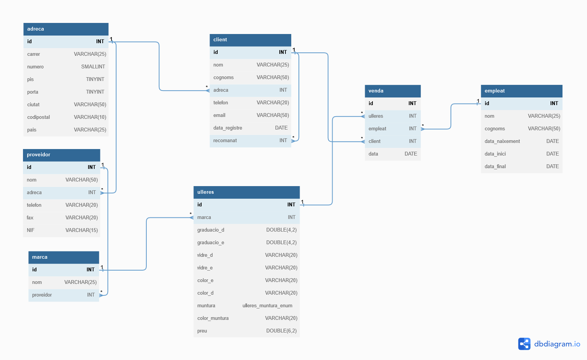

# Òptica Cul d'Ampolla

## Queries

### Llista el total de compres d’un client/a.

Si sabem l'ID del client/a que ens interessa, aleshores podem fer la consulta:

    SELECT marca.nom AS Marca, venda.data AS 'Data de venda'
    FROM venda JOIN ulleres ON venda.ulleres = ulleres.id
        JOIN marca ON ulleres.marca = marca.id
        JOIN client ON venda.client = client.id
    WHERE client.id = 1;

I a `client.id` hi posem l'ID que ens interessi.

### Llista les diferents ulleres que ha venut un empleat durant un any.

Similar a l'anterior, si sabem l'ID de l'empleat/a que ens interessa fem la consulta:

    SELECT empleat.nom AS Venedor, marca.nom AS Marca, ulleres.preu AS Preu, YEAR(venda.data) AS Any
    FROM venda JOIN ulleres ON venda.ulleres = ulleres.id
        JOIN marca ON ulleres.marca = marca.id
        JOIN empleat ON venda.empleat = empleat.id
    WHERE empleat.id=2 AND YEAR(venda.data)=2020;

A `client.id` triem l'ID que ens interessi ia `YEAR(venda.data)` l'any que ens interessa.

### Llista els diferents proveïdors que han subministrat ulleres venudes amb èxit per l'òptica.

    SELECT COUNT(venda.id) AS Vendes, proveidor.nom AS Proveidor
    FROM venda JOIN ulleres ON venda.ulleres=ulleres.id
        JOIN marca ON ulleres.marca=marca.id
        JOIN proveidor ON marca.proveidor=proveidor.id
    GROUP BY Proveidor
    ORDER BY Vendes DESC;

## Comentaris a la Base de Dades

Algunes consideracions a la base de dades. Comentaris que m'he fet sobretot per mi per anar justificant el procés.

### Adreces

"Adreça" considero que no és ben bé que sigui una entitat, però al ser una característica compartida tant pels clients com pels proveïdors, amb els mateixos camps, he pensat que podria tenir una taula pròpia.

- _Pis_ i _Porta_: He triat _TINYINT_ però tinc els meus dubtes, ja que no sé si podria ser porta A, porta B, o bé principal o entresol. Per això els he fet _unsigned_, i valors engatius que no tenen sentit podrien ser utilitzats per a referenciar entresol, principal i coses d'aquestes.

### Vidres

En realitat, amb més informació, potser hi podria haver una taula "Tipus_vidre" i crear una clau forana de la taula "Ulleres" -> "Tipus vidre" pels camps vidre_d i vidre_e. Similar pels colors.

Això, o bé, fer-lo del tipus __Enum__, però no he veig tant clar, ja que es poden crear nous tipus de vidre al futur o nou colors disponibles i caldria modificar les característiques de la taula.

Ja que menciono el color. El camp _color_ de les ulleres l'he posat _Null_ per defecte que seria el color transparent.

### Vendes

La taula vendes és la típica que podria tenir una clau primària composta de diversos camps, però un mateix empleat podria vendre les mateixes ulleres al mateix client, ja sigui el mateix dia o en dies diferents. A més, el camp client he considerat que sí que pot ser _Null_ ja que per protecció de dades o coses d'aquestes un client podria demanar que s'eliminessin les seves dades del sistema. Per empleats les condicions ja serien diferents i una empresa li interessa quins ex-empleats ha tingut.