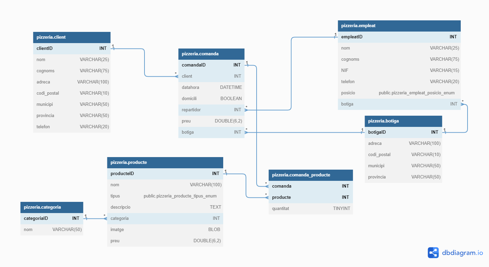

# Pizzeria

## Queries

### Llista quants productes de tipus “Begudes”. s'han venut en una determinada localitat.

Si sabem l'id de la localitat que ens interessa aleshores podem fer la consulta següent: 

    SELECT SUM(comanda_producte.quantitat) AS 'Begudes Venudes'
    FROM comanda_producte JOIN producte ON comanda_producte.producte=producteID
        JOIN comanda ON comanda_producte.comanda=comandaID
    WHERE producte.tipus='beguda' AND
        comanda.botiga=1;

I a `comanda.botiga` hi posem l'id que ens interessa.

Si volem generalitzar i veure les begudes venudes per cada localitat aleshores podem fer la consulta:

    SELECT comanda.botiga AS 'ID de la Botiga', SUM(comanda_producte.quantitat) AS 'Begudes Venudes'
    FROM comanda_producte JOIN producte ON comanda_producte.producte=producteID
        JOIN comanda ON comanda_producte.comanda=comandaID
    WHERE producte.tipus='beguda'
    GROUP BY comanda.botiga;

### Llista quantes comandes ha efectuat un determinat empleat/da.

Similar amb la consulta anterior, si només ens interessa un empleat en concret, fem la consulta:

    SELECT COUNT(comandaID) AS 'Comandes Repartides'
    FROM comanda JOIN empleat ON comanda.repartidor=empleatID
    WHERE empleatID=2;

I a `empleatID` hi posem l'ID que ens interessi.

Si volem generalitzar i veure les comandes efectuades per cada empleat (repartidor(e)s en aquest cas):

    SELECT empleatID AS 'ID del repartidor', nom, cognoms, COUNT(comandaID) AS 'Comandes Repartides'
    FROM comanda JOIN empleat ON comanda.repartidor=empleatID
    GROUP BY empleatID;

## Comentaris a la Base de Dades

Algunes consideracions a la base de dades. Comentaris que m'he fet sobretot per mi per anar justificant el procés.

Tant pels municipis com per les províncies, podríem tenir taules per a cadascuna, amb els valors possibles (potser no es pot repartir a totes les províncies sinó només a algunes en concret; _idem_ per municipis) i fer la clau forana corresponent, tant pels clients com per les botigues.

### Empleat

Posició podria ser un boolean, repartidor o cuiner, però he triat ENUM per si hi poguéssin haver més posicions a considerar en un futur, encarregat, cambrer, etc.

### Producte

Per a la imatge del producte he triat el tipus BLOB, tot i que una altra manera també útil d'emmagatzemar les imatges podria ser un VARCHAR i s'hi emmagatzema un enllaç a la imatge, per exemple: '/pizzeria/imatges/pizza_margarita.png'. Per actualitzar o modificar la imatge, no caldria tocar la base de dades, sinó l'arxiu de la imatge allà on estigui allotjada.

### Comanda_Prodcute

La clau forana al producte l'he posat amb `DELETE RESTRICT`. En un establiment suposo que és interessant saber les comandes passades que s'han fet, i per molt que es deixi de vendre un producte, si eliminessim també aquest valor, es perdria informació de vendes anteriors. Si es posés amb Null, perdríem el preu de la comanda.

Aquest argument també explica perquè totes les claus foranes a la taula COMANDA estan posades amb `DELETE SET NULL`, per no perdre informació de vendes anteriors.

### Restriccions necessàries

- Tots els productes tipus!=pizza -> categoria=NULL
- Poder comprovar que comanda.preu == suma de producte.preu*comanda_producte.quantitat