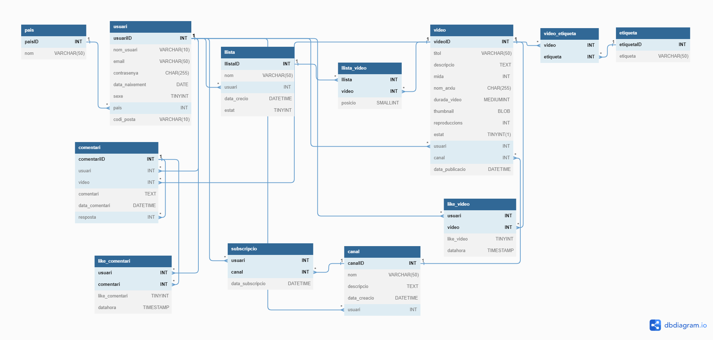
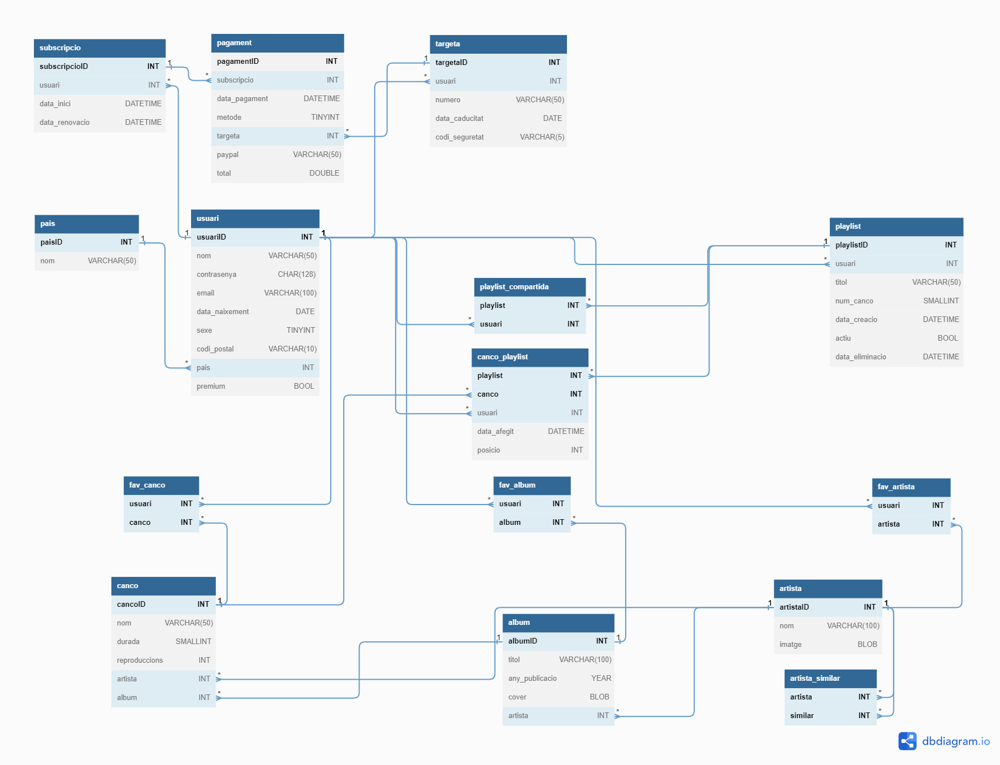

# Nivell 1

Les bases de dades del Nivell 1 estan a les carpetes corresponents.

# Nivell 2 - Youtube

# Nivell 3 - Spotify

## Pagaments

El mètode de pagament l'he especificat a cada pagament (és a dir a la taula pagament) i no a la subscripció, ja que he pensat que potser et subscrius volent pagar amb targeta, però arriba un punt que potser prefereixes fer el canvi a PayPal. Es podria fer que el mètode de pagament preferent és aquell que s'ha fet servir per última vegada.

## Favorits

No he volgut fer-ho a l'exercici, però he pensat d'un mètode alternatiu per a guardar els artistes, albums i cançons favorites d'un usuari en una sola taula.

Enlloc de tenir les taules `fav_artista`, `fav_album`, `fav_canco` tenir una sola taula:

    CREATE TABLE `youtube`.`favorit` (
        usuari INT,
        favorit VARCHAR(10),
        PRIMARY KEY (`usuari`, `favorit`),
        CONSTRAINT `FK_Usuari_Favorit` FOREIGN KEY (`usuari`) REFERENCES `usuari` (`usuariID`) ON UPDATE CASCADE ON DELETE CASCADE
    );

Fins aquí normal. Però els favorits es guarden de la següent manera: Si fas favorit a un artista guardes el valor `'art_${artistaID}'`, un àlbum `alb_${albumID}` i si fas favorit una cançó aleshores `'can_${cancoID}'`.

Aleshores per buscar els albums favorits d'un usuari faríem la consulta:

    SELECT *
    FROM album JOIN favorit ON favorit=CONCAT('alb_', albumID)
    WHERE favorit.usuari=${usuariID}

I podem canviar `alb_` per `can_` o `art_`.

Els possibles problemes que veig potser serien que no hi ha les relacions fetes entre les taules favorits -> artista/album/canco i per tant no sabem si tenim valors contradictoris o erronis a la taula favorits (p.e. alb_125 i no hi ha cap album amb albumID=125); tampoc es creen els índexs i, per tant, en una base de dades possiblement molt gran com la de Spotify aquest procés potser seria computacionalment molt costós per trobar els favorits (ara hi penso, i potser creant l'índex jo, no seria tan lent el mètode).